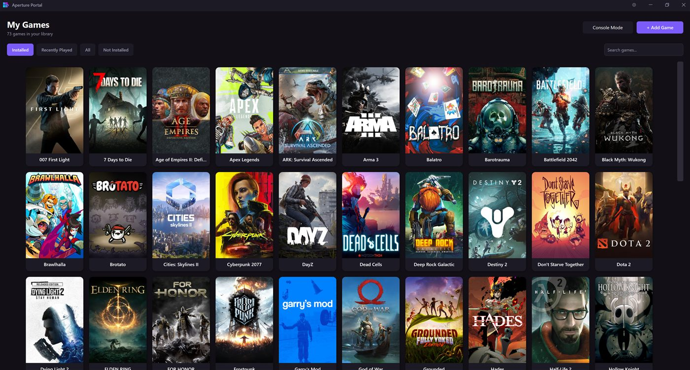
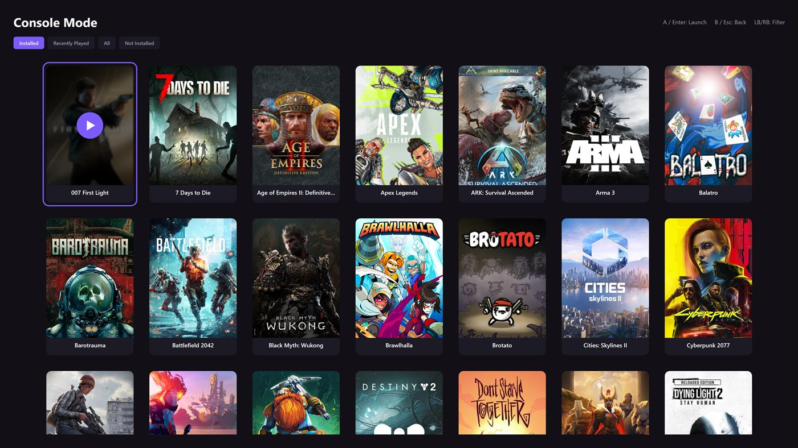
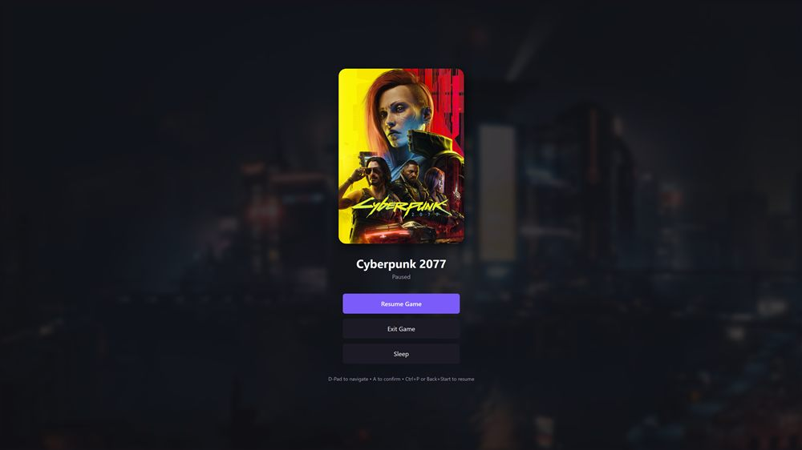

# Aperture Portal

A desktop game launcher for Windows built around one idea: Windows never gave you a real console-style rest mode. Every other launcher makes you close your game, or just minimizes it and calls it a day. Aperture Portal actually suspends the game and puts the PC to sleep, then wakes both back up exactly where you left off. PlayStation rest mode, but on your PC.

On top of that it's a normal game launcher too: it pulls your library together from Steam, Epic, and GOG, plus anything you add by hand, and gives you a couch-friendly, gamepad-only Console Mode to browse it all from.



## Features

- **Sleep without losing your place:** hit Sleep from the in-game overlay and Aperture Portal suspends the game's process (not just alt-tabs away from it) and puts the whole PC to sleep. Wake the PC back up and resume, and the game picks up exactly where it was, not from a checkpoint or an autosave.
- **In-game overlay:** pause, resume, exit, or sleep a running game with a controller (Back+Start) or the keyboard (Ctrl+P), without ever alt-tabbing out.
- **Steam sync:** pulls in games already installed on your PC, or your whole owned library (including Family Sharing) via browser sign-in or a Steam Web API key. Tracks real install/download progress by reading Steam's own manifests.
- **Epic Games & GOG sync:** local, automatic detection of installed games, no login required.
- **Manual add:** for anything else (Battle.net, Xbox/Game Pass, or a plain .exe), point it at the executable and tag which platform it's from.
- **Console Mode:** a fullscreen, gamepad-navigable view of your library for when you're on the couch. Built for Xbox-compatible (XInput) controllers, with arrow keys, Enter, and Escape as a keyboard fallback.
- **Cover art:** auto-fetched from [SteamGridDB](https://www.steamgriddb.com/) (needs a free API key), or picked manually per game.
- **Startup options:** launch with Windows, and/or skip straight to Console Mode instead of the normal window.

|  |  |
|---|---|
|  |  |

## Hotkeys

**Keyboard**

| Key | Where | Does |
|---|---|---|
| Ctrl+P | While a game is running | Opens the in-game overlay (pause/resume/exit/sleep). |
| Arrow keys | Console Mode | Move the selection around the grid. |
| Enter | Console Mode | Launch the selected game. |
| Escape | Console Mode | Go back / exit Console Mode. |

**Controller**

| Button | Where | Does |
|---|---|---|
| Back + Start | While a game is running | Opens the in-game overlay. Same as Ctrl+P. |
| D-pad / left stick | Main window & Console Mode | Move the selection. |
| A | Main window & Console Mode | Launch / activate the selected game. |
| B | Console Mode | Go back. |
| LB / RB | Console Mode | Switch between filter tabs. |

## Install

Download the latest installer from [Releases](../../releases). It defaults to a per-user install (no admin rights, no UAC prompt) but can also install for all users if you need it in Program Files. Either way you get a Start Menu shortcut.

Requires Windows 10/11 (x64).

## Building from source

Requires the [.NET 10 SDK](https://dotnet.microsoft.com/download).

```
dotnet build
```

To produce a self-contained release build (what the installer packages):

```
dotnet publish -c Release -r win-x64 --self-contained true -p:PublishSingleFile=true -p:IncludeNativeLibrariesForSelfExtract=true -o publish
```

### Building the installer

Requires [Inno Setup 6](https://jrsoftware.org/isinfo.php). After publishing (above):

```
ISCC.exe installer\ApertureOS.iss
```

The compiled installer lands in `installer-output\`.

## Notes

- Steam login via the embedded browser never sees your password. It's a real Steam sign-in page, and only the resulting session is used to read your library.
- The "Log in via Steam" flow depends on the WebView2 Runtime, which ships with Windows 11 and most up-to-date Windows 10 installs. If it doesn't work, install it from [Microsoft's WebView2 page](https://developer.microsoft.com/microsoft-edge/webview2/).
- Epic/GOG-synced games and manually-added games launch directly rather than through their platform's own client, since ApertureOS has no install/download tracking for those platforms. A small number of anti-cheat-protected Epic titles may need to be re-added pointed at the Epic Games Launcher instead.
- Your library, settings, and cover art cache live in `%APPDATA%\ApertureOS`, never in this repo or the installer. A fresh install always starts empty.
- Works well as the local front end for a [Sunshine](https://github.com/LizardByte/Sunshine)/Moonlight streaming setup, since Console Mode is fully controller-driven and needs no keyboard or mouse.

## Feedback

This is a solo project, still rough around the edges, and I'd rather improve it alongside people who want the same thing than guess in the dark. If something's broken or missing, [open an issue](../../issues). I'm reading them.
